# Biological Variation Report

This report was created using the **BV** tool for analyzing biological variation data. **BV** is developed by **Turcosa Analytics** and can be accessed online at http://opensoft.turcosa.com.tr/BV 

Additional documentation for the **BV**, including instructions on how to download the application for offline use, can be found at https://github.com/selcukorkmaz/BV

# Introduction

In this report, we consider the scenario where we have prior evidence that the treatment might work better in a one subpopulation than another. We use the term "adaptive design" to refer to a group sequential design that starts by enrolling from both subpopulations, and then decides whether or not to continue enrolling from each subpopulation based on interim analyses.  We use the term "standard designs" to refer to group sequential designs where the enrollment criteria are fixed.

*******
# 1. Outlier Detection

## 1.1. Step 1: Outliers in the sets of duplicate results using the Cochran test

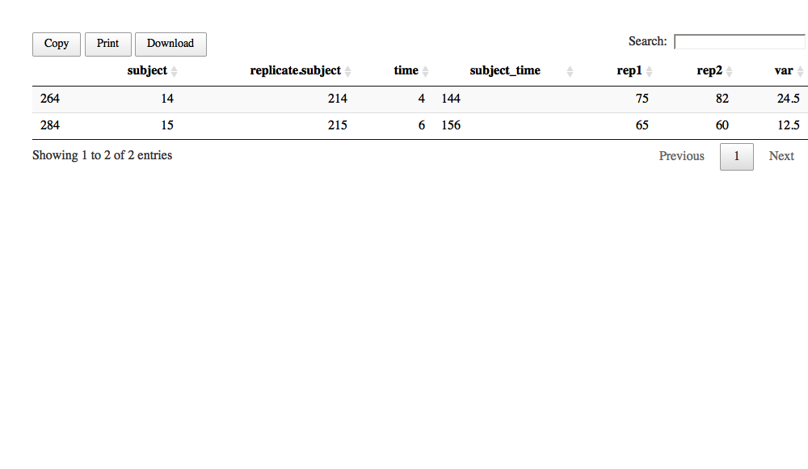
*******

## 1.2. Step 2: Outliers in the variances of the results from each subject using the Cochran test

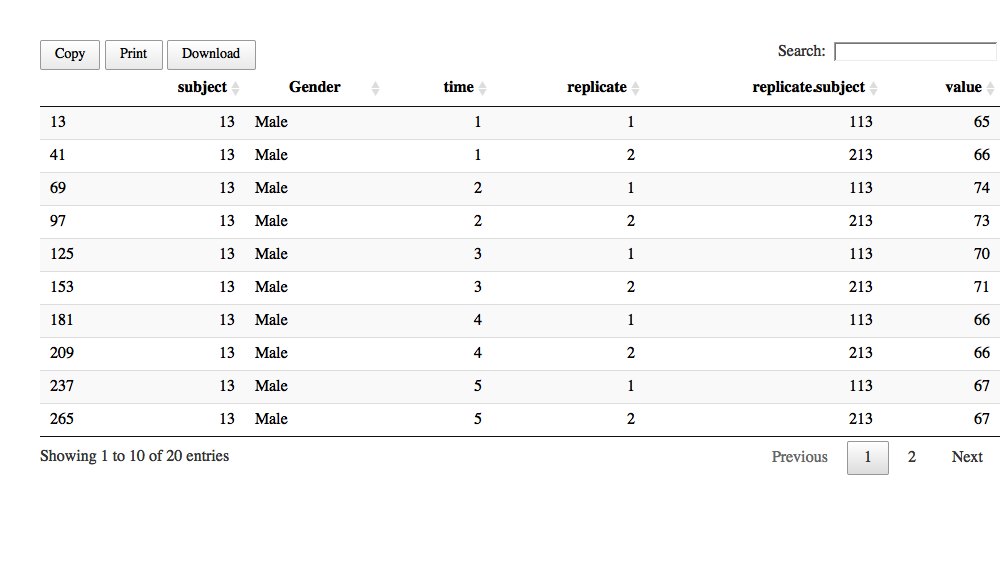
*******

## 1.3 Step 3: Outliers in the variances of the results from each subject using the Cochran test

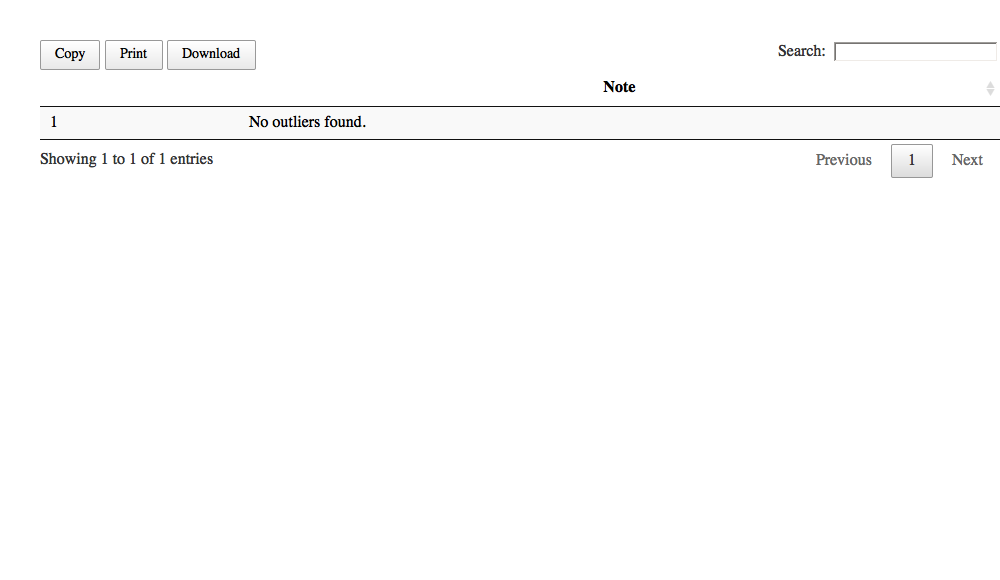
*******

# Normality Test
## 2.1. Step 1: On set of results from each individual
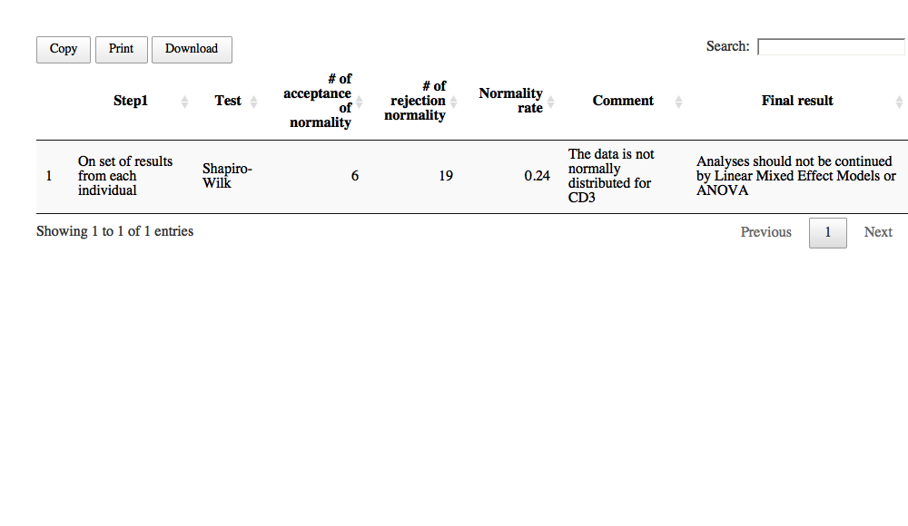

## 2.2. Step 2: On mean values of subjects
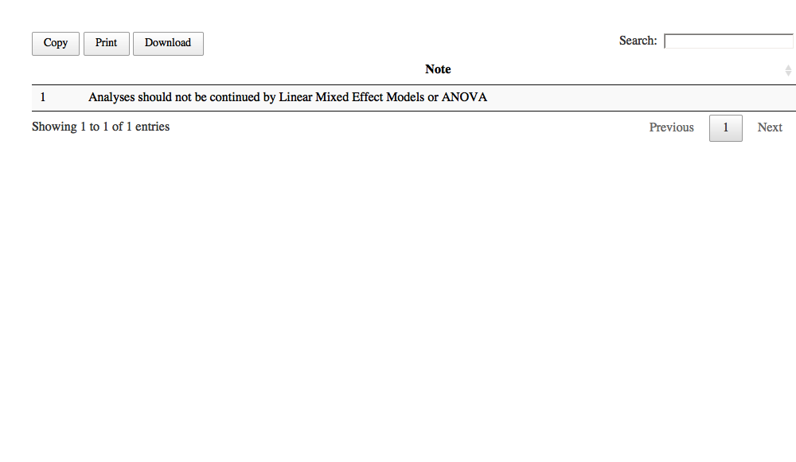

# 3. Subset Analysis
## 3.1. Step 1: Student's t test for mean differences of gender
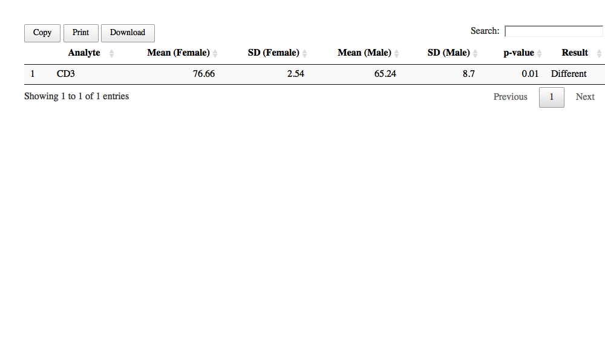

## 3.2. Step 2: Student's t test for average within-subject total variance
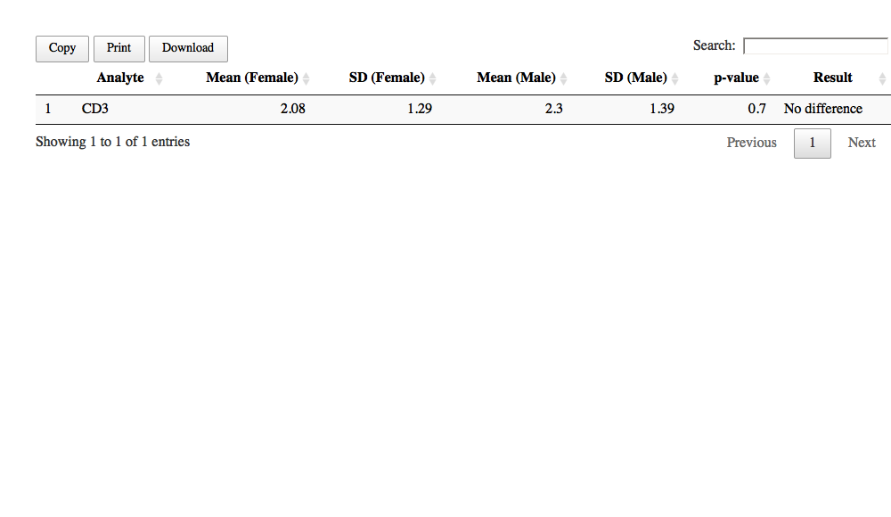

# 4. Analysis of Variance
## 4.1. All subjects

### 4.1.1. Step 1: Coefficient of variation results

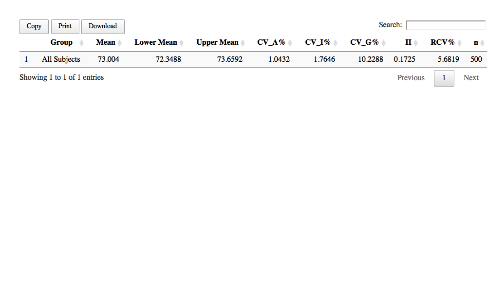

### 4.1.2. Step 2: Analysis of variance table

### 4.1.3. Step 3: Quality measures

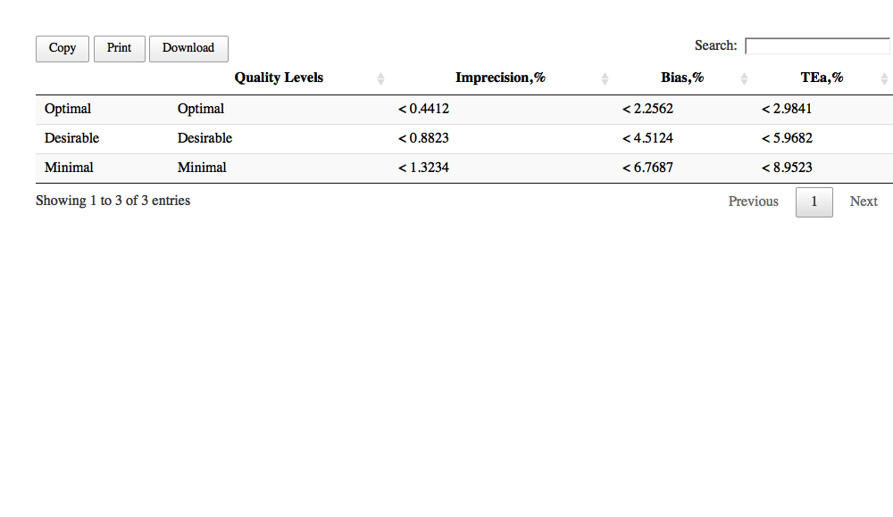

## 4.2. Gender 1

### 4.2.1. Step 1: Coefficient of variation results
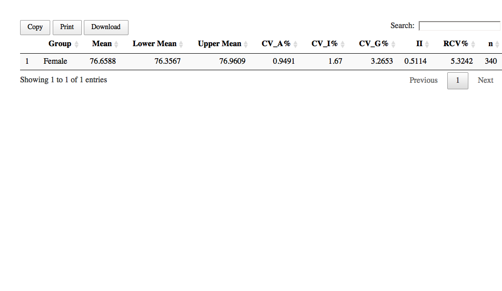

### 4.2.2. Step 2: Analysis of variance table
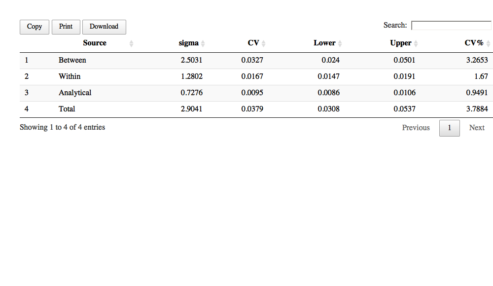

### 4.2.3. Step 3: Quality measures
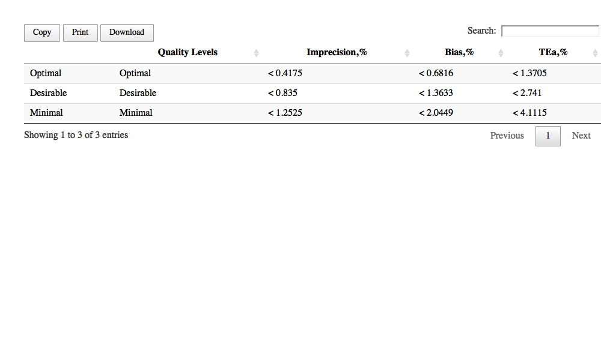

## 4.3. Gender 2

### 4.3.1. Step 1: Coefficient of variation results
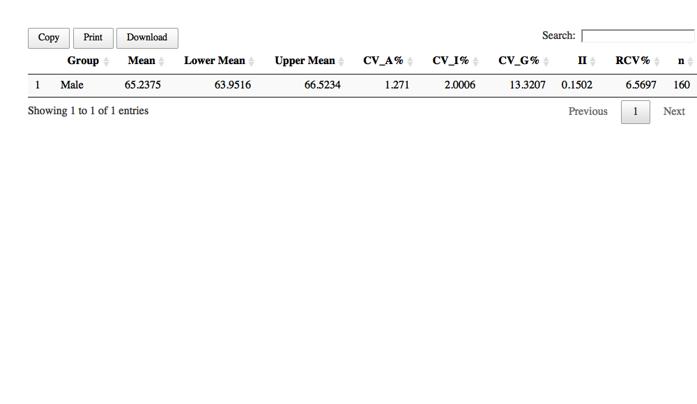

### 4.3.2. Step 2: Analysis of variance table
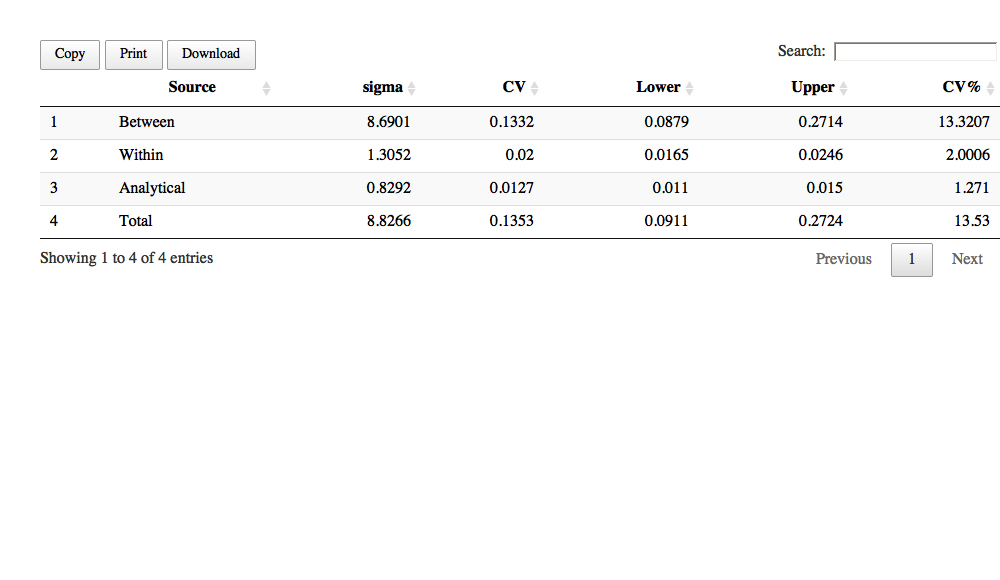

### 4.3.3. Step 3: Quality measures
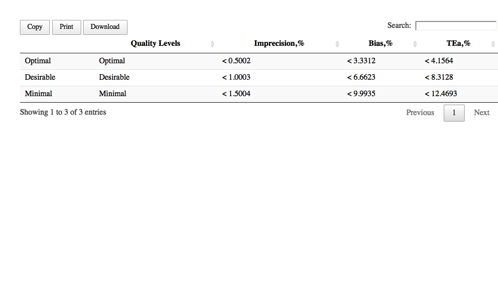

